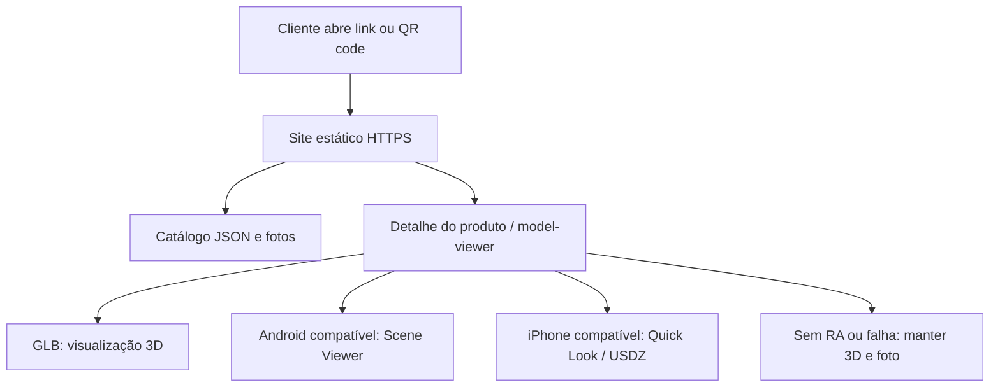

# Cardápio 3D com realidade aumentada — plano do MVP

Data: 08/09/2026. Status: arquitetura proposta; aplicação e validação física ainda não executadas.

## 1. Objetivo e viabilidade

Permitir que o cliente consulte o cardápio, examine cada item em 3D e o posicione sobre uma mesa em realidade aumentada (RA), em escala correspondente às dimensões cadastradas.

A ideia é tecnicamente viável. O principal risco é a fidelidade do conteúdo: dimensões, aparência e apresentação do modelo precisam representar a comida servida. Um visualizador funcionando com um modelo genérico comprova a integração técnica, mas não comprova essa fidelidade.

Adotar a expressão “visualizar em tamanho real”, acompanhada das medidas em centímetros. O arquivo pode ser calibrado em escala 1:1; a RA não deve ser apresentada como instrumento de medição exata. Rastreamento, superfície, iluminação e variação do preparo podem afetar o resultado percebido. O zoom da visualização 3D na tela não representa tamanho físico.

## 2. Escopo

Uma pizzaria, catálogo estático e interface pensada primeiro para celular. Primeira prova com uma pizza; após aprovação, ampliar para dois tamanhos de pizza e um prato para validar formatos diferentes.

Funcionalidades:

- Lista com foto, nome, descrição, categoria e preço.
- Detalhe com ingredientes, tamanho e visualização 3D com rotação e zoom.
- Seleção de tamanho quando houver variantes cadastradas.
- Botão “Ver na sua mesa”, com posicionamento horizontal e escala fixa.
- Carregamento, erro com nova tentativa e foto disponível se 3D ou RA falharem.
- Link compartilhável para o produto e acesso ao site por QR code.

Ficam fora deste MVP: pedidos, pagamento, carrinho, login, painel administrativo, múltiplas lojas, estoque e geração automática de modelos. Alterações no catálogo serão feitas em arquivo e publicadas junto com o site.

## 3. Arquitetura proposta

| Parte | Escolha | Motivo |
| --- | --- | --- |
| Aplicação | Vite + TypeScript + HTML/CSS | Poucas telas e estado simples; dispensa framework neste primeiro teste |
| Visualização | Componente web `@google/model-viewer` | Reúne visualização 3D e integração com modos de RA |
| Dados | JSON local validado no build | Cadastro pequeno, sem servidor de aplicação |
| Conteúdo | GLB, USDZ e imagens estáticas | Arquivos entregues diretamente ao navegador e visualizadores nativos |
| Hospedagem | Um serviço estático com HTTPS | Publicação simples e URLs acessíveis pelos visualizadores |
| Modelagem | Ajuste e exportação em ferramenta 3D, fora do site | Mantém a aplicação pequena e permite calibrar os modelos |



Não há necessidade de backend, banco, Docker ou infraestrutura própria para este escopo. Fixar as versões de dependências no lockfile quando o projeto for criado.

### Caminhos de realidade aumentada

Começar com `ar-modes="scene-viewer quick-look"`: Scene Viewer no Android compatível e Quick Look no iPhone compatível. A interação de RA ocorre no visualizador do sistema; os controles do site não acompanham essa tela. O cliente escolhe o tamanho antes de abrir RA. [Exemplo oficial de integração](https://modelviewer.dev/examples/augmentedreality/).

WebXR fica como experimento posterior, caso precisemos de controles dentro da sessão. Não é requisito para validar esta primeira experiência.

No Android, Scene Viewer depende de aparelho compatível com ARCore e dos serviços necessários atualizados. Usar Safari no iPhone e Chrome no Android como navegadores prioritários de teste. Navegadores embutidos em aplicativos precisam de verificação específica; oferecer orientação para abrir no navegador quando necessário. [Requisitos do Scene Viewer](https://developers.google.com/ar/develop/scene-viewer).

Configuração de referência, a implementar:

```html
<model-viewer
  src="/models/frango-35/model.glb"
  ios-src="/models/frango-35/model.usdz"
  poster="/images/frango-35.webp"
  alt="Pizza de frango com catupiry de 35 cm sobre prato de 39 cm"
  camera-controls
  touch-action="pan-y"
  ar
  ar-modes="scene-viewer quick-look"
  ar-scale="fixed"
  ar-placement="floor"
></model-viewer>
```

`floor` significa superfície horizontal, incluindo uma mesa. `ar-scale="fixed"` solicita escala de 100% e impede redimensionamento nos modos suportados; verificar o comportamento nos aparelhos do piloto. [Referência de atributos](https://modelviewer.dev/docs/index.html).

Publicar arquivos por HTTPS, com URLs absolutas resolvíveis, tipos MIME apropriados e sem autenticação. Manter tudo na mesma origem inicialmente. O visualizador nativo pode buscar o arquivo separadamente, portanto um endereço apenas acessível na máquina de desenvolvimento não basta para o piloto.

## 4. Organização do código

```text
index.html
src/
  main.ts
  styles.css
  data/menu.json
  types/menu.ts
  components/catalog.ts
  components/product-detail.ts
  components/product-viewer.ts
public/
  models/<variante>/model.glb
  models/<variante>/model.usdz
  images/<variante>.webp
scripts/
  validate-catalog.mjs
docs/
  validacao-dispositivos.md
models/                         # fontes existentes; preservar
```

Usar um identificador no endereço, como `?produto=frango-catupiry&tamanho=35`, para compartilhar o detalhe sem exigir roteamento no servidor. Um único visualizador ativo; a lista exibe imagens. Carregar o modelo apenas quando o detalhe for aberto e liberar o anterior ao trocar de produto.

O componente de visualização concentra carregamento, falhas e acionamento da RA. O catálogo apenas fornece os dados da variante selecionada. Selecionar outra variante deve atualizar preço, medidas, foto e arquivos de forma consistente, bloqueando a abertura de RA enquanto a troca estiver incompleta.

## 5. Contrato dos dados

Cada produto terá `id`, `name`, `description`, `category`, `ingredients`, `available` e `variants`. Cada variante terá:

| Campo | Conteúdo |
| --- | --- |
| `id`, `label` | Identificador estável e nome comercial do tamanho |
| `priceCents` | Preço inteiro em centavos, com apresentação em BRL |
| `foodDimensionsCm` | Diâmetro ou largura/profundidade e altura da comida |
| `presentationDimensionsCm` | Dimensões totais, incluindo prato ou suporte |
| `includesPlate` | Indica se o modelo inclui recipiente ou prato |
| `poster`, `glb`, `usdz` | Caminhos dos arquivos; USDZ pode ficar ausente no experimento inicial |
| `scaleVerified` | Registro interno de que a escala passou pela conferência |

Preços, ingredientes e medidas ainda não fornecidos devem ser identificados como dados de demonstração durante o desenvolvimento. Não inferir dimensões da comida a partir do tamanho total do prato.

Cada tamanho comercial deve apontar para arquivos já calibrados. Evitar transformar a pizza inteira por escala uniforme para mudar só o diâmetro: isso também altera altura, ingredientes e prato. Ajustes feitos apenas no navegador podem não acompanhar o arquivo aberto pelo visualizador nativo. [Comportamento de transformações por modo](https://modelviewer.dev/examples/scenegraph/).

## 6. Preparação dos modelos e escala

Já existem em `models/pizza_frango/`:

- GLB padrão de aproximadamente 2,7 MB e alternativa Draco de 1,6 MB.
- Imagem de prévia e textura.
- `LEIA-ME.txt`, que informa pizza com 0,350 m de diâmetro, prato de 0,390 m, 55.372 triângulos e eixo Y para cima.

Essas dimensões são declarações do arquivo de instruções, ainda não verificadas na geometria nem em RA. Não foi encontrado USDZ nesse diretório. Começar pelo GLB padrão para reduzir dependências de decodificação.

Pipeline de cada variante:

1. Medir um produto real representativo: diâmetro/largura, profundidade, altura e recipiente. Registrar fotos e medidas de referência.
2. Criar ou ajustar o modelo com essas referências; fotogrametria é uma opção a experimentar, não uma garantia de qualidade automática.
3. Aplicar transformações e exportar GLB em metros. Uma pizza de 35 cm deve medir 0,35 m. Posicionar a base do conjunto na superfície de apoio, com orientação consistente.
4. Exportar USDZ com unidades equivalentes e conferir os metadados de escala. Quick Look considera a unidade indicada no arquivo. [Orientações da Apple](https://developer.apple.com/videos/play/wwdc2023/10274/).
5. Conferir separadamente a geometria da pizza e a do prato, materiais e dimensões finais de ambos os formatos.
6. Gerar imagem de apresentação e otimizar os arquivos sem perder qualidade útil.
7. Validar lado a lado com referências físicas no Android e no iPhone.

Na primeira prova, é possível experimentar a geração automática de USDZ pelo `model-viewer` quando `ios-src` é omitido. Para o piloto aprovado, preferir um USDZ previamente gerado e conferido para tornar a qualidade do arquivo reproduzível. [Geração automática e alternativa explícita](https://modelviewer.dev/examples/augmentedreality/).

Meta interna inicial: arquivo 3D de até 5 MB por formato e textura em torno de 1024–2048 px, sujeita à avaliação visual. Esses valores são orçamento do projeto, não limites universais das plataformas. Não adicionar geometrias de mesa ou cenário ao modelo do produto.

## 7. Fluxo do cliente

1. Abre o link ou QR code e vê o catálogo com fotos.
2. Seleciona produto e tamanho; lê preço e medidas.
3. Gira e aproxima o modelo em 3D.
4. Toca em “Ver na sua mesa”.
5. O visualizador solicita as permissões necessárias e orienta o reconhecimento da superfície.
6. Posiciona o alimento, mantendo o tamanho calibrado, e retorna ao cardápio.

Mostrar antes da abertura: “Aponte para uma mesa bem iluminada e mova o celular devagar”. Exibir claramente “Pizza: 35 cm · Prato: 39 cm” no exemplo inicial. Não insinuar que o prato do modelo acompanha a entrega se isso não for verdade; essa apresentação deve ser confirmada com a pizzaria.

Se não houver suporte, manter foto, dimensões e visualização 3D disponível. Se o próprio 3D falhar, o cardápio textual e a imagem permanecem utilizáveis. Evitar prometer detecção infalível de suporte: tratar também erros de abertura.

## 8. Sequência de implementação

| Etapa | Entrega | Critério de saída |
| --- | --- | --- |
| 1 — Prova técnica | Página mínima com a pizza existente, 3D, RA, medidas e HTTPS | Abrir em Android e iPhone físicos; verificar dimensões do modelo e alinhamento na mesa |
| 2 — Calibração | GLB e USDZ conferidos; comparação com referências físicas | Escala satisfatória nos dois sistemas e registro dos resultados |
| 3 — Cardápio MVP | Lista, detalhe, variantes, preço, estados de carregamento e falha | Fluxo completo utilizável também sem RA |
| 4 — Piloto | Poucos produtos, QR code e teste com clientes | Avaliar entendimento do tamanho, aparência e dificuldade de uso |

Não produzir todo o catálogo em 3D antes de concluir as duas primeiras etapas. O trabalho de captura, ajuste e conferência de cada prato pode ser mais relevante que o desenvolvimento do site.

## 9. Validação e decisão de continuar

Teste físico mínimo em um Android compatível com ARCore e um iPhone compatível, registrando modelo do aparelho, sistema, navegador, formato usado e versão do conteúdo. Incluir desktop e um cenário sem RA para verificar alternativas.

Para a pizza inicial, usar um círculo físico medido de 35 cm e outro de 39 cm como referência, sobre a mesma superfície. Observar de cima e de outros ângulos, repetindo o posicionamento três vezes por aparelho. Registrar diferenças aparentes e capturas; não tratar essa comparação visual como medição metrológica.

Meta de aceitação proposta para o piloto: diferença aparente de diâmetro até aproximadamente 5% em condições controladas, sem redimensionamento manual, e sem deslocamento persistente perceptível em relação à mesa. É uma meta a validar, não uma precisão garantida pela tecnologia. Se não for atingida, revisar unidades, exportação, origem do modelo e rastreamento antes de expandir o catálogo.

Verificar também:

- Materiais e aparência comparáveis entre GLB no navegador e USDZ no iPhone.
- Tentativa de pinça em RA não altera o tamanho calibrado.
- Troca de variante abre o modelo correto, inclusive após voltar da RA.
- Permissão negada, rede lenta, arquivo ausente e aparelho sem suporte não impedem a consulta do cardápio.
- Layout e rolagem funcionam no celular; botões têm texto e o conteúdo permanece acessível.
- Meta inicial de modelo interativo em até 5 segundos numa conexão de teste documentada; ajustar otimização se necessário.

Automatizar validação do catálogo (IDs únicos, preços válidos, medidas positivas e existência dos arquivos), checagem de TypeScript e build. Testes automatizados não substituem a validação de RA em aparelhos reais.

Fazer um piloto observado com cinco pessoas e registrar: conseguiram abrir a RA sem ajuda, entenderam o tamanho e reconheceram a apresentação do prato? Contar cliques de abertura não comprova posicionamento bem-sucedido em visualizadores nativos; usar observação neste MVP, sem infraestrutura de analytics.

## 10. Pendências para executar o piloto

- Medidas reais e confirmação de como a pizza é entregue, incluindo presença ou ausência do prato.
- Android e iPhone disponíveis para testes físicos.
- Dados comerciais e dois ou três itens representativos para o catálogo posterior.
- Escolha da hospedagem HTTPS no momento de publicar.

A preparação local da prova técnica pode começar com os arquivos existentes. O MVP só estará validado após os testes físicos; o planejamento e a renderização no computador não comprovam escala em RA.
